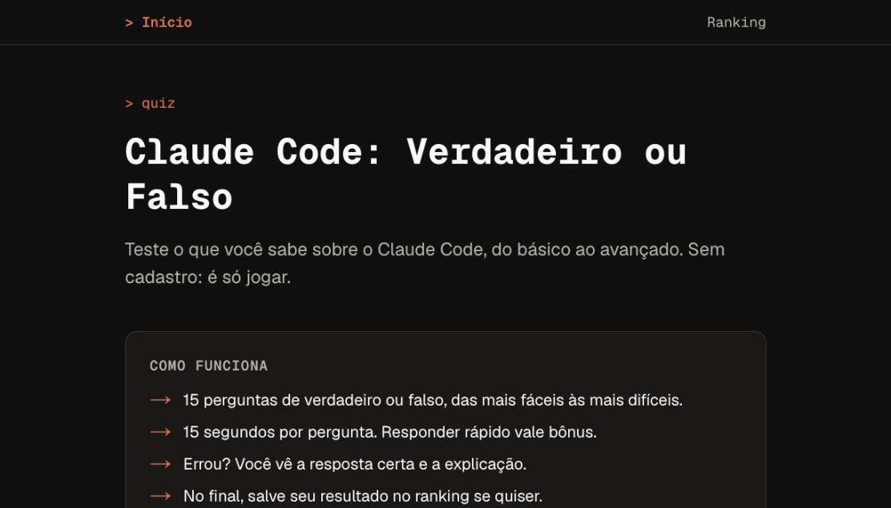
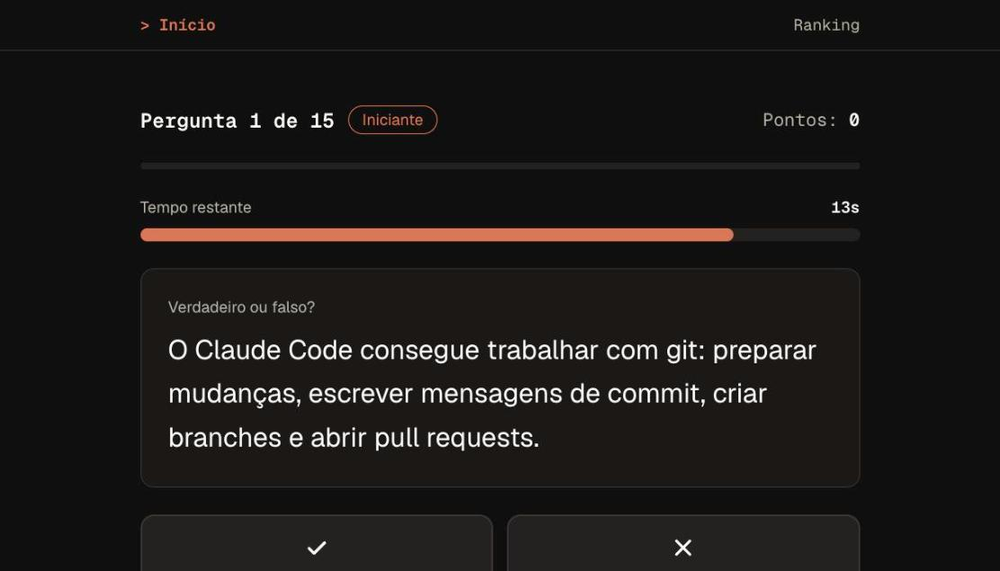
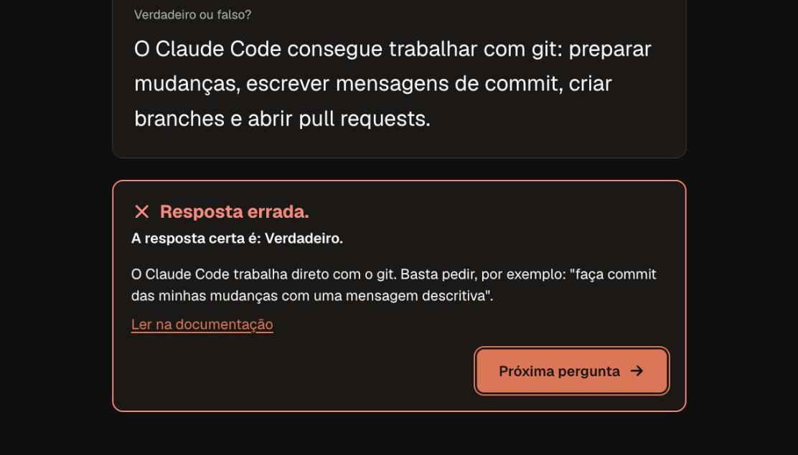
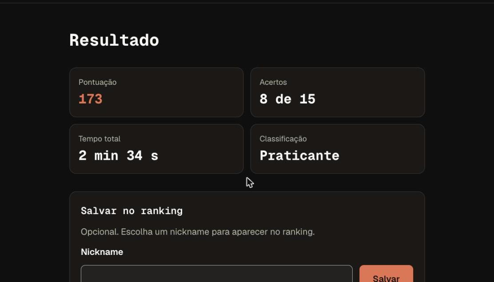
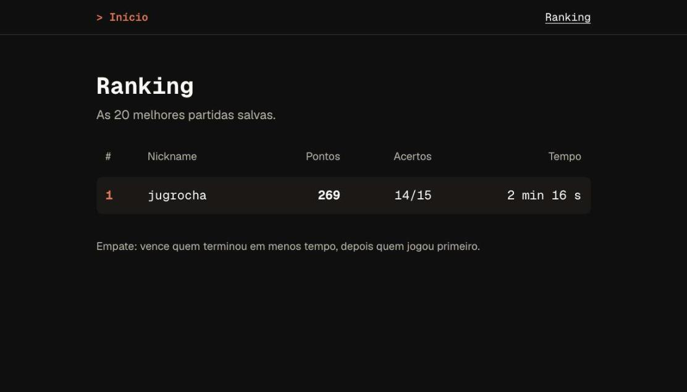

# Claude Code: Verdadeiro ou Falso

Quiz de verdadeiro ou falso sobre o [Claude Code](https://code.claude.com/docs/en/overview): 15 perguntas, 15 segundos cada, do básico ao avançado. Sem cadastro, com ranking opcional no final.

**Jogue agora:** https://quiz-first-project-claude-code.vercel.app

| Início                                     | Pergunta                                             | Feedback do erro                                                 |
| ------------------------------------------ | ---------------------------------------------------- | ---------------------------------------------------------------- |
|  |  |  |

| Resultado                                            | Ranking                                         |
| ---------------------------------------------------- | ----------------------------------------------- |
|  |  |

## Como funciona

- **15 perguntas por partida**, em três faixas fixas: 5 de nível iniciante, 5 intermediárias e 5 avançadas. As perguntas de cada faixa são sorteadas, sem repetir na partida e com no máximo 2 da mesma categoria.
- **15 segundos por pergunta.** Se o tempo acabar, conta como erro.
- **Pontos:** 10, 15 ou 20 por acerto, conforme o nível, mais um bônus por velocidade de até 50%. A pontuação máxima é 335. Erro não tira pontos.
- **Errou?** O jogo mostra a resposta certa, a explicação e um link para a documentação oficial.
- **Classificação** por número de acertos: Curioso (0–5), Praticante (6–9), Especialista (10–12), Mestre (13–14) e Lenda do Claude Code (15).
- **Ranking:** no final você pode salvar o resultado com um nickname. O ranking mostra as 20 melhores partidas. No empate, vence quem terminou em menos tempo e, depois, quem jogou primeiro.
- **Jogar novamente** dá prioridade às perguntas que você ainda não viu nas últimas partidas.
- **Acessível:** dá para jogar só com o teclado (atalhos `V` e `F`). O jogo funciona com leitor de tela, respeita "reduzir movimento" e se adapta a telas de 360 px.

## Stack

- [Next.js 16](https://nextjs.org) (App Router) com TypeScript estrito e Tailwind CSS v4
- [Supabase](https://supabase.com) (Postgres) para guardar as partidas e o ranking
- [Vitest](https://vitest.dev) para os testes, mais ESLint e Prettier
- Hospedagem na [Vercel](https://vercel.com) e CI no GitHub Actions

## Rodar localmente

Requisitos: Node.js 20.9 ou mais novo e um projeto Supabase. O projeto pode ficar no Supabase Cloud (plano grátis) ou rodar local pelo Supabase CLI, que precisa de Docker.

```bash
git clone https://github.com/jugrocha/quiz-first-project-claude-code.git
cd quiz-first-project-claude-code
npm install
cp .env.example .env.local
```

### Opção A: Supabase local (Docker)

```bash
npx supabase start   # sobe o Postgres local e aplica as migrações
npx supabase status  # mostra a service_role key
```

Coloque a `service_role key` em `SUPABASE_SERVICE_ROLE_KEY` no `.env.local`. A `SUPABASE_URL` já vem certa (`http://127.0.0.1:54321`).

### Opção B: Supabase Cloud

1. Crie um projeto em [supabase.com](https://supabase.com/dashboard).
2. Aplique as migrações da pasta `supabase/migrations`. Use `npx supabase link` seguido de `npx supabase db push`, ou cole cada arquivo `.sql`, em ordem, no SQL Editor do painel.
3. No `.env.local`, preencha `SUPABASE_URL` (`https://<ref>.supabase.co`) e `SUPABASE_SERVICE_ROLE_KEY`. Essa chave fica em _Project Settings → API Keys_.

Depois, em qualquer uma das opções:

```bash
npm run dev   # http://localhost:3000
```

Sem `SUPABASE_URL` e `SUPABASE_SERVICE_ROLE_KEY`, o jogo funciona com as partidas só na memória: dá para jogar, mas nada é salvo.

### Variáveis de ambiente

| Variável                    | Para quê                                                                                          |
| --------------------------- | ------------------------------------------------------------------------------------------------- |
| `SUPABASE_URL`              | Endereço do projeto Supabase.                                                                     |
| `SUPABASE_SERVICE_ROLE_KEY` | Chave secreta, usada **só no servidor**. Nunca use o prefixo `NEXT_PUBLIC_` nem a coloque no git. |
| `NEXT_PUBLIC_SITE_URL`      | Opcional. Link usado no texto de compartilhar. Sem ela, o site usa o próprio endereço.            |

### Comandos

```bash
npm run dev           # servidor de desenvolvimento
npm run build         # build de produção
npm run lint          # ESLint
npm run typecheck     # gera os tipos de rota do Next e roda tsc
npm test              # testes (Vitest)
npm run format        # formata com Prettier
```

## Arquitetura e decisões

- **O servidor decide tudo.** O navegador nunca envia pontuação e só recebe a resposta certa e a explicação depois de responder. As perguntas com o gabarito (`src/data/questions.json`) ficam só no servidor, e um teste garante que nenhum gabarito vaza.
- **Timer controlado pelo servidor.** O servidor anota quando cada pergunta foi mostrada e confere o tempo quando a resposta chega. Há 2 s de tolerância para a latência da rede. A barra de tempo na tela é só visual.
- **O timer pausa no feedback.** A próxima pergunta só é entregue, e o tempo dela só começa, quando o jogador pede (`POST /api/games/{id}/next`). Assim ninguém perde tempo lendo a explicação, nem consegue ler a próxima pergunta antes da hora.
- **"Só uma vez" garantido no banco.** Responder e salvar usam updates condicionais (compare-and-set). Duas requisições ao mesmo tempo nunca são aceitas juntas.
- **Supabase só no servidor**, com a service role. A tabela `games` tem RLS ativado e nenhuma policy pública.
- **Se o Supabase cair, ainda dá para jogar.** A partida é criada na memória do servidor e salvar no ranking mostra um erro com a opção de tentar de novo.
- **Limite de requisições por IP** nas rotas de escrita, em memória. Nenhum IP é guardado.
- **Limpeza automática:** um job do `pg_cron` apaga todos os dias as partidas não salvas com mais de 7 dias.

### API

| Rota                          | O que faz                                                                                                 |
| ----------------------------- | --------------------------------------------------------------------------------------------------------- |
| `POST /api/games`             | Cria a partida e devolve a 1ª pergunta. Aceita `{ seen }`: ids que devem ser evitados.                    |
| `POST /api/games/{id}/next`   | Devolve a pergunta atual e inicia o timer dela. Pode ser chamada de novo sem reiniciar o tempo.           |
| `POST /api/games/{id}/answer` | `{ questionId, answer: true \| false \| null }`. Devolve se acertou, a explicação e, na última, o resumo. |
| `POST /api/games/{id}/save`   | `{ nickname }`. Salva no ranking uma única vez.                                                           |
| `GET /api/ranking`            | Top 20.                                                                                                   |

Os erros sempre têm o formato `{ "error": { "code": "...", "message": "..." } }`.

## Banco de perguntas

São 40 perguntas em `src/data/questions.json`: 14 de nível iniciante, 13 intermediárias e 13 avançadas, metade verdadeiras. Elas cobrem quatro categorias: fundamentos, features, API/SDK e boas práticas. Cada uma foi conferida na [documentação oficial do Claude Code](https://code.claude.com/docs/en/overview) e tem um link para a página que confirma a resposta.

**Última revisão das perguntas: 7 de outubro de 2026.** O Claude Code muda rápido, então vale revisar de tempos em tempos.

Para editar ou adicionar perguntas:

- Mantenha os `id` existentes, porque as partidas salvas apontam para eles.
- Rode `npm test`. Os testes verificam o formato e as metas do banco: pelo menos 10 por nível, cerca de 50% verdadeiras, todas as categorias em cada nível e o link da documentação.

## Deploy

O site roda na Vercel (plano Hobby) e é publicado sozinho a cada push na `main`.

1. Importe o repositório na Vercel. O Next.js é detectado automaticamente.
2. Cadastre `SUPABASE_URL` e `SUPABASE_SERVICE_ROLE_KEY` em _Settings → Environment Variables_. Mudou alguma variável? Faça um **Redeploy**.
3. O `vercel.json` fixa as funções em `pdx1` (Oregon), perto do Supabase em `us-west-2`. Se o seu Supabase estiver em outra região, ajuste esse valor.
4. Aplique as migrações no Supabase de produção. Uma delas agenda a limpeza diária com `pg_cron`. Para conferir se a limpeza está ativa: `select jobname, schedule from cron.job;`.

O CI (`.github/workflows/ci.yml`) roda lint, typecheck, testes e build em cada push e pull request.

## Manutenção

```sql
-- Remover um nickname ofensivo do ranking
delete from public.games where nickname = 'nick_ruim';

-- Rodar a limpeza de partidas antigas na hora
select public.purge_unsaved_games();
```

## Limitações conhecidas

- **O nickname não tem senha nem precisa ser único.** Qualquer pessoa pode usar o nickname de outra. O filtro de palavrões é básico.
- **O limite de requisições fica na memória** de cada instância da Vercel, então é aproximado. Para algo mais rígido, seria preciso um armazenamento compartilhado, como Upstash ou Vercel KV.
- **O site em produção usa o mesmo projeto Supabase do desenvolvimento.** Partidas salvas a partir do `localhost` aparecem no ranking público.
- **As perguntas podem ficar desatualizadas** conforme o Claude Code evolui. Veja a data da última revisão acima.
- **Sem contas, painel de administração ou versão em inglês** nesta versão.
